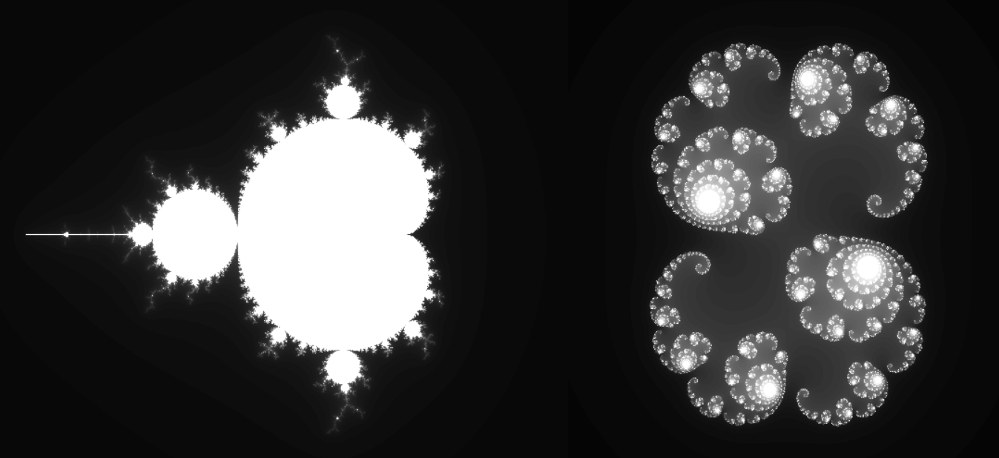
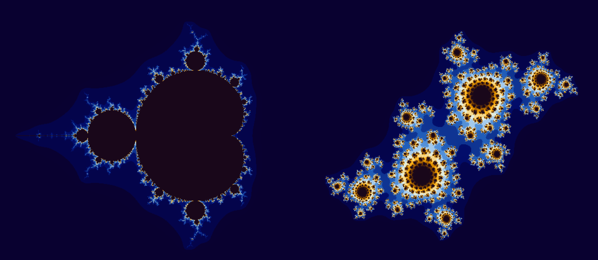
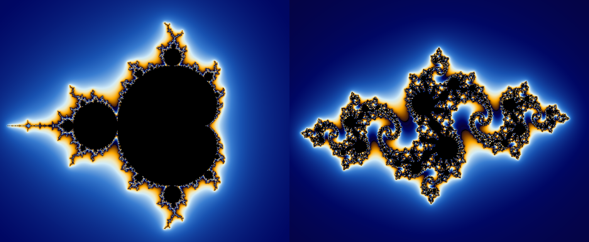
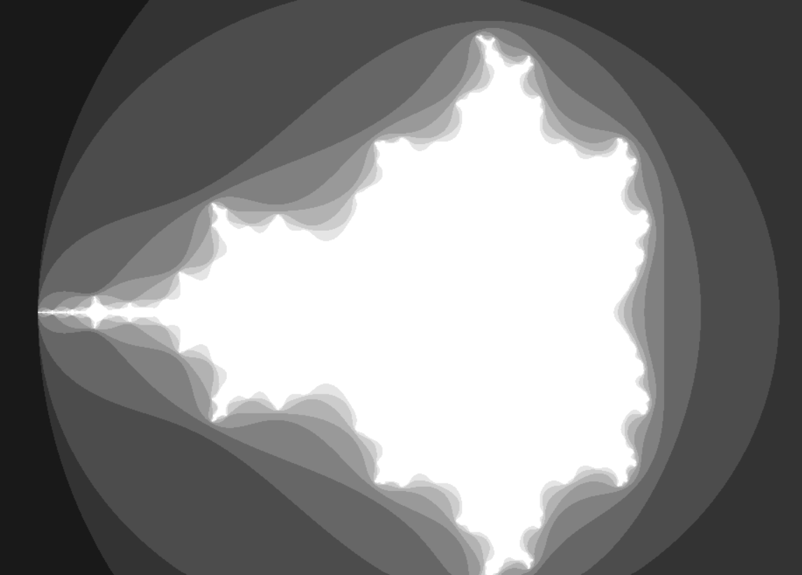

<h1><table border="0px"><tr><td valign="center"></td><td valign="center">Multibrot & Julia Sets Visualization</td></tr></table></h1>

This project is a visualizer for the Multibrot and Julia Sets.

Try the web [demo](https://xhst.github.io/multibrot-set/).
## 🔎 About
### ✤ Multibrot Set

The **Multibrot Set** $\mathcal{M}$ is the set of values in the complex plane whose absolute value remains below some finite value throughout iterations.

$$f_c : \mathbb{C} \longrightarrow \mathbb{C}$$

in the form:

$$f_c(z) = z^p + c$$

For each complex parameter $c$ we consider the behavior of the succession $(0, f_c(0), f_c(f_c(0)), \dots )$ obtained by iterating $f_c(z)$ from the point $z = 0$ this can either diverge to infinity or be limited.
The Multibrot set is defined as the set of points $c$ such that the corresponding subsequence is limited. 
The previous succession can also be written as:

$$\begin{cases}z_0 = 0 \\
z_{n+1} = z^p + c\end{cases}$$

if we indicate with $f^n_c(z)$ the $n$-th iteration of $f_c(z)$, $(f_c \circ f_c \circ \dots \circ f_c)(z)$ self composed $n$ times, the Multibrot Set is:

$$\mathcal{M} =  \\\{\ c \in \mathbb{C} : \sup_{n \in \mathbb{N}}\ |f^n_c(z)| < \infty \\}\ $$

The case of $p = 2$ is the classic Mandelbrot set from which the name is derived. 

To visualize a Multibrot Set, one typically starts with a grid of complex numbers in the complex plane. For each complex number $c$ on the grid, we generate the sequence by iteratively applying the function $f_c$ starting from $z = 0$. 
Each point $c$ on the grid is then colored according to the behavior of its corresponding sequence. The point is colored according to the number of iterations it took for the sequence to exceed a certain threshold. This process results in a fractal image that represents the Multibrot Set.

### ✷ Julia Set

The **Julia Set** $\mathcal{J}$ is a subset of the complex plane that, like the Multibrot Set, is associated with the behavior of complex dynamical systems. However, while the Multibrot Set is defined by the behavior of a sequence of complex numbers under iteration by a function, the Julia Set is defined by the behavior of a single complex number under iteration by the same function.

For a given complex number $c$, the Julia Set is defined as the set of all complex numbers $z$ such that the sequence $(z, f_c(z), f_c(f_c(z)), \dots)$ does not tend towards infinity. In other words, the Julia Set for a given $c$ is the set of all $z$ for which the sequence remains bounded under iteration by the function $f_c(z) = z^p + c$.
We ha to fix a value $B > 0$ such that $B^2 - B \ge |c|$, then the filled Julia set for this system is the subset of the complex plane given by 

$$\mathcal{J} = \\\{\ z \in \mathbb{C} : \forall n \in \mathbb{N}, |f^n_c(z)| \le B\\}\  $$

Each Julia Set is associated with a unique point in the Multibrot Set, and the shape of the Julia Set can provide insights into the behavior of the complex dynamical system associated with its corresponding point in the Multibrot Set.

Visualizing the Julia Set involves a process similar to the Multibrot Set, but with a slight variation. We begin with a point $c$ from the Multibrot Set, then we iterate the function $f_c(z)$ where $z$ is a complex number in the Julia complex plane, with each point colored according to the number of iterations it took for the sequence to exceed a certain threshold.
 

## 🟢 Getting started
### ✔️ Prerequisites
You need to have Node.js and npm installed on your machine. You can download Node.js [here](https://nodejs.org/en/download/) and npm is included in the installation.
### 🛠 Installation
First, clone the repository to your local machine:
```
git clone https://github.com/xhst/multibrot-set.git
```
then, navigate to the project directory and install the dependencies with:
```
npm install
```
### ▶️ Build
To build the application, run:
```
npm run build
```

## 🖼️ Screenshots
#### Mandelbrot and Julia sets, point $(0.2815, -0.0085i)$, with grayscale coloring


#### Mandelbrot and Julia sets, point $(-0.245, -0.655i)$, with linear coloring


#### Mandelbrot and Julia sets, point $(-0.8, -0.155i)$, with normalized iteration count (6 bail-out radius) coloring


#### 10 iterations Mandelbrot


#### 100 iterations Mandelbrot


#### 1000 iterations Mandelbrot

